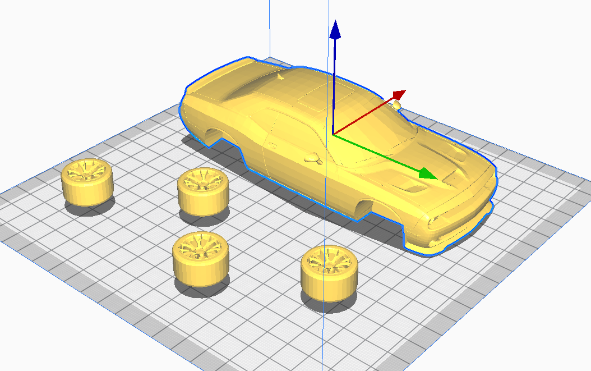

# t-018-challenger-hellcat
3d print of challenger hellcat

## v1.00  
* model from thingiverse by 1000%
* 22h print; PLA
* 70g of material; 23.45m
* layer height = .06mm
* extruder temp = 200.0c
* bed temp = 60.0c
* infill = 10%
* support structure = tree
* support overhang angle = 85deg (needed to to create support all over where it wasn't needed)
* support zDistance = .1mm (distance between top of support and bottom of structure)
